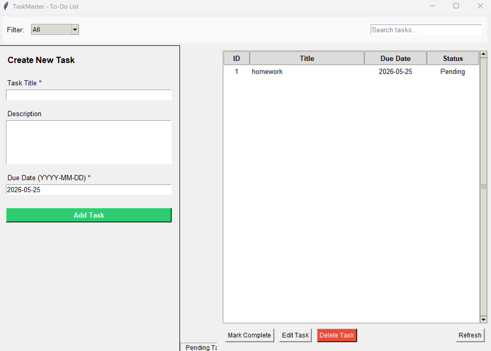

# TaskMaster - Desktop To-Do List Application

A lightweight, high-performance desktop application designed for local task management.

## Features

- ✅ Add, edit, delete tasks
- ✅ Mark tasks as complete
- ✅ Search tasks by title/description
- ✅ Filter by status (Pending/Completed)
- ✅ Auto-save to JSON file
- ✅ No internet connection required
- ✅ No external dependencies

## Screenshots

### Main Window


### Adding a New Task


### Mark Task as Complete


### Edit Task Window


### Search and Filter


## Installation

1. Make sure you have Python 3.x installed
2. Clone the repository:
   ```bash
   git clone https://github.com/Emirhan-52/TaskMaster.git